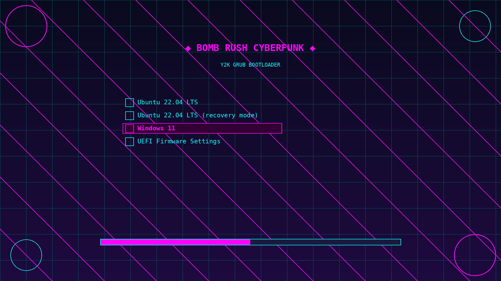

# Bomb Rush Cyberfunk Y2K GRUB Theme 🎨✨

A vibrant GRUB bootloader theme inspired by Y2K aesthetics and Bomb Rush Cyberfunk's street art style. Features bright neon colors (cyan and magenta), futuristic grid patterns, and a retro-futuristic vibe.

## ✨ Features

- **Y2K Aesthetic**: Bright neon colors, grid patterns, and futuristic design
- **Bomb Rush Cyberfunk Vibes**: Street art inspired, vibrant and energetic
- **Custom Color Scheme**: Cyan (#00ffff) and Magenta (#ff00ff) accents on dark blue background
- **Boot Menu Icons**: Custom icons for different OS options
- **Easy Installation**: Automated install/uninstall scripts
- **Compatible**: Works with GRUB2 on most Linux distributions

## 🎨 Color Palette

- Background: Dark blue gradient (#0a0a1f to #1a1a3f)
- Primary accent: Cyan (#00ffff)
- Secondary accent: Magenta (#ff00ff)
- Text: Bright neon colors for high visibility

## 📋 Requirements

- GRUB2 bootloader
- Linux distribution with GRUB2 support
- Root/sudo access for installation

## 🚀 Installation

### Automatic Installation (Recommended)

1. Clone or download this repository:
```bash
git clone https://github.com/Lumexio/Bomb-Rush-Cyberfunk-Y2K-GRUB-Theme.git
cd Bomb-Rush-Cyberfunk-Y2K-GRUB-Theme
```

2. Run the installation script with sudo:
```bash
sudo ./install.sh
```

3. Reboot your system to see the new theme!

### Manual Installation

1. Copy the theme directory to GRUB themes folder:
```bash
sudo cp -r theme /boot/grub/themes/bomb-rush-cyberfunk-y2k
```

2. Edit GRUB configuration:
```bash
sudo nano /etc/default/grub
```

3. Add or modify the following line:
```
GRUB_THEME="/boot/grub/themes/bomb-rush-cyberfunk-y2k/theme.txt"
```

4. Update GRUB:
```bash
sudo update-grub
# OR on some systems:
sudo grub-mkconfig -o /boot/grub/grub.cfg
```

5. Reboot to see the theme!

## 🗑️ Uninstallation

To remove the theme and restore default GRUB appearance:

```bash
sudo ./uninstall.sh
```

Or manually:
1. Remove the theme line from `/etc/default/grub`
2. Run `sudo update-grub`
3. Delete the theme folder: `sudo rm -rf /boot/grub/themes/bomb-rush-cyberfunk-y2k`

## 📁 Theme Structure

```
theme/
├── theme.txt           # Main theme configuration
├── background.png      # Y2K/cyberpunk background image
├── scrollbar_thumb_c.png # Scrollbar component
└── icons/              # Boot menu icons
    ├── linux.png
    ├── windows.png
    ├── ubuntu.png
    ├── debian.png
    ├── arch.png
    ├── settings.png
    ├── recovery.png
    └── unknown.png
```

## 🎮 Customization

You can customize the theme by editing `theme/theme.txt`:

- **Colors**: Modify `item_color`, `selected_item_color`, etc.
- **Font sizes**: Adjust font size values in the configuration
- **Positions**: Change `left`, `top`, `width`, `height` percentages
- **Background**: Replace `background.png` with your own image (1920x1080 recommended)

## 🐛 Troubleshooting

**Theme not appearing after installation:**
- Ensure the theme path in `/etc/default/grub` is correct
- Run `sudo update-grub` or `sudo grub-mkconfig -o /boot/grub/grub.cfg`
- Check GRUB version: `grub-install --version`

**Icons not showing:**
- Verify icon files exist in `theme/icons/` directory
- Check file permissions: `sudo chmod -R 644 /boot/grub/themes/bomb-rush-cyberfunk-y2k/*`

**Font issues:**
- The theme uses Terminus font. If unavailable, GRUB will use default font

## 📜 License

MIT License - See [LICENSE](LICENSE) file for details

## 🙏 Credits

Inspired by:
- **Bomb Rush Cyberfunk** - Team Reptile's amazing game
- **Y2K aesthetic** - The vibrant, futuristic design style from the late 90s/early 2000s

## 🌟 Contributing

Contributions are welcome! Feel free to:
- Submit bug reports or feature requests via Issues
- Create pull requests with improvements
- Share your customizations

## 📸 Preview



*The theme features a dark blue gradient background with cyan grid lines, magenta and cyan text, and custom neon-colored boot icons.*

---

Made with 💜 by [Lumexio](https://github.com/Lumexio)